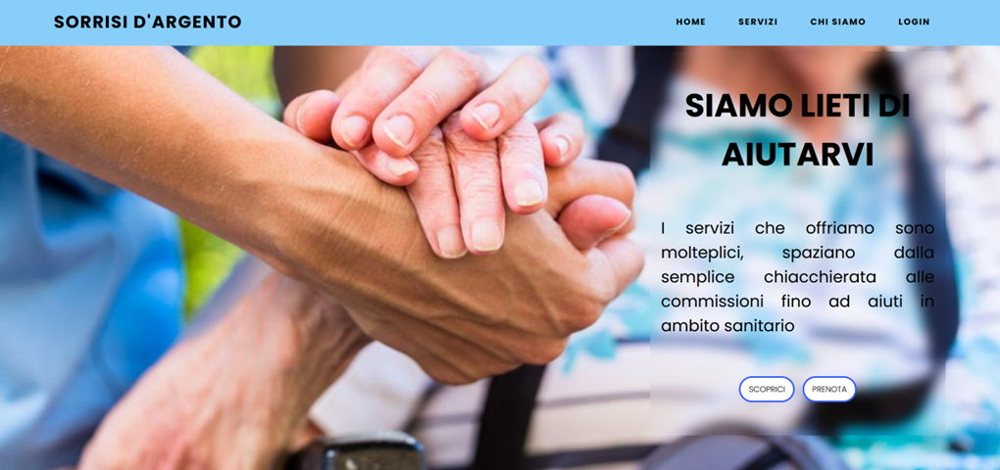
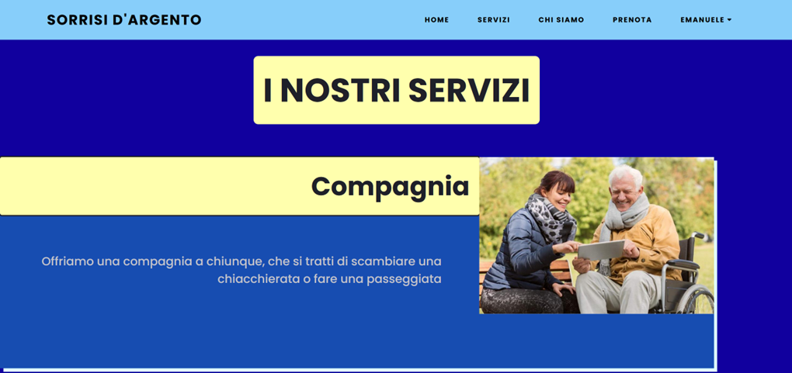

# EXECUTIVE SUMMARY

## Descrizione della realtà di interesse in relazione al tema assegnato

Il progetto assegnatoci è volto alla realizzazione di un sito per un’associazione di volontariato dedicata all’assistenza agli anziani. 
Il volontariato è un’attività no-profit realizzata da volontari al fine di poter aiutare in modi differenti le persone che si rivolgono ai rispettivi sportelli aperti al pubblico. 
I volontari possono ricoprire diversi ruoli e differenziarsi per competenze, offrendo conseguentemente servizi diversi tra loro in base a quelli più richiesti. 
La gestione di tali servizi è necessaria e fondamentale al fine di schedulare in maniera efficiente e rapida i vari turni di servizio presso gli anziani, in modo da poter proporre il miglior aiuto possibile evitando eventuali disservizi. 
A tal fine, considerato il panorama tecnologico disponibile oggigiorno e associato al settore, il sito Sorrisi d’Argento si fa carico di queste necessità e si propone come un’alternativa valida, intuitiva e completa. 

## Obiettivo del sito web

L'obiettivo principale del sito è offrire agli anziani la possibilità di prenotare un servizio di assistenza fornito dai nostri operatori.
-	Per poter usufruire di tale servizio, gli anziani (o chi per loro) devono effettuare l’accesso o registrarsi al sito.
-	Se l'utente accede in forma anonima, non avrà la possibilità di prenotare un servizio di assistenza. 

I servizi che offriamo comprendono:
-	compagnia
-	commissioni
-	assistenza sanitaria ai nostri clienti

forniti dai nostri operatori qualificati. 

Inoltre, offriamo la possibilità di unirsi alla nostra squadra di operatori compilando un modulo in cui bisogna inserire i dati personali e indicare i giorni in cui si è disponibili ad effettuare il volontariato, accompagnati da una (opzionale) breve descrizione delle competenze. 

## Descrizione preliminare sintetica del contenuto del sito

Il sito web si impernia su 5 pagine web, ciascuna dedicata a specifici servizi e funzionalità. 
L’obiettivo del sito è facilitarne l’uso da parte degli utenti, i quali, nella nostra casistica, sono rappresentati dagli anziani o da chi ne fa le veci. 

A tal fine, gli utenti finali sono stati divisi in:
-	utenti registrati o loggati, i quali possono accedere a tutti i servizi proposti;
-	utenti anonimi, non registrati o che non hanno effettuato l’accesso al sito, i quali dovranno accedere o registrarsi al fine di poter usufruire dei servizi completi offerti dal sito.

In peculiar modo, gli utenti anonimi non potranno accedere alla pagina Prenota destinata alla prenotazione dei servizi.

## Limitazioni

Per quanto concerne quest’ambito, la limitazione principale è causata dal numero di pagine massime, pari a cinque, che ci ha impedito di approfondire tutti gli aspetti specifici, come ad esempio una pagina dedicata all’area personale all’interno della quale vedere  le proprie prenotazioni. 
Per tale motivo, si è preferito inserire le prenotazioni effettuate in un sottomenu a tendina consultabile dalla voce “PRENOTAZIONI” disponibile nel menu del sito soltanto per gli utenti che effettuano l’accesso.

# PROGETTAZIONE

Il sito, volto all’assistenza agli anziani, si compone di 5 pagine web:

1) Homepage: http://localhost/Site-Project/Homepage/homepage.php
    > L’Homepage fornisce una panoramica del sito, permettendo all’utente di poter vedere i servizi messi a disposizione dall’organizzazione, di poter prenotare un servizio e di potersi unire al gruppo di operatori nell’assistenza verso gli anziani, il tutto tramite pulsanti ideati appositamente al fine di rendere i processi più intuitivi.

2) Servizi: http://localhost/Site-Project/Servizi/servizi.php
    > La pagina Servizi mostra, tramite immagini e descrizioni, i servizi offerti dalla nostra organizzazione come la compagnia, l’aiuto nelle commissioni e l’assistenza sanitaria. 
    Sul fondo della pagina inoltre è presente anche un pulsante per poter prenotare uno di questi servizi.

3) Login: http://localhost/Site-Project/Login-Logout/log.php
    > Nella pagina di Login è possibile effettuare la registrazione, se si tratta di nuovi utenti, oppure, se si è già utenti, l’accesso al sito inserendo le proprie credenziali. 
    Una volta identificati come utenti del sito, si ha la possibilità di accedere alla pagina dedicata alla prenotazione dei servizi, di modo da poter selezionare il servizio di assistenza che si vuole richiedere.

4) Prenota: http://localhost/Site-Project/Prenota/prenota.php
    > Una volta effettuato l’accesso è possibile accedere alla pagina Prenota, dove si può prenotare il servizio richiesto, effettuando, qualora lo si desiderasse, anche una preferenza sull’operatore.

5) Chi Siamo: http://localhost/Site-Project/Chi-Siamo/chi-siamo.php
    > La pagina Chi Siamo del sito web è dedicata a fornire una descrizione dettagliata del nostro progetto e della sua finalità, dopodiché sono mostrati, insieme alle loro rispettive immagini, gli operatori impegnati nell'aiuto agli anziani. 
    Inoltre, è presente un form che permette agli utenti interessati di candidarsi per unirsi al nostro team di volontari.

# DESCRIZIONE DI  EVENTUALI FOGLI DI STILE ESTERNI E DELLA  CONFIGURAZIONE DEL DATABASE

Ogni pagina web ha un proprio foglio di stile (CSS3) associato per avere un aspetto ordinato e rifinito e, dove necessario, anche un file javascript. 
Lo stile dell’header e del footer si presenta uguale in tutte le pagine, con la posizione fissa sul fondo in modo da non impedire la visuale durante la navigazione. 
L’immagine sullo sfondo nelle pagine Prenota e Login è la stessa ed è stata scelta in base alle caratteristiche della palette colori del sito stesso. 
Nella Homepage, invece, sono state scelte due immagini per lo sfondo di ciascuna sezione (upper e central), configurandole, nel file CSS associato, in modo tale da ottenere l’effetto parallasse (parallax effect) durante lo scorrimento della pagina. 

È inoltre presente un collegamento con un database chiamato “TSW”, con username ‘www’ e password ‘tsw2023’, sul quale vengono memorizzati i dati ogni volta che:
-	viene effettuata una registrazione;
-	viene presentata una candidatura;
-	viene prenotato un servizio.
 
# DESCRIZIONE DEL SITO

## HOMEPAGE

La pagina principale, come le altre, si compone di un header, posizionato sempre sopra qualsiasi altro elemento, che permette di accedere a tutte le altre pagine del sito e di un footer, posizionato sul fondo della pagina, contenente i cookie, i quali indicano le visite effettuate sulla singola pagina e l’ultimo accesso alla stessa, e i contatti  social dell’associazione. 

La prima sezione centrale della pagina è caratterizzata da una breve descrizione dei servizi offerti e permette di:

-	scoprire il nostro gruppo di operatori, candidandosi eventualmente lo si volesse, oppure

-	potersi prenotare, se l’utente è registrato o ha effettuato l’accesso.

> Nel caso in cui  non abbia effettuato l’accesso, alla pressione del pulsante PRENOTA, l’utente verrà notificato con un alert che lo inviterà a registrarsi, reindirizzandolo alla pagina di Login.

Nella seconda sezione della Homepage vi è la possibilità di potersi unire alla squadra di operatori premendo il bottone UNISCITI.

### HEADER

L’header si compone di due parti:
-	a sinistra è presente il logo dell’organizzazione
-	a destra vi è il menu per la navigazione nel sito

Il menu presenta alcune variazioni a seconda dello stato di accesso dell'utente.

#### MENU PER UTENTI ANONIMI

 
Per quanto concerne gli utenti anonimi che accedono al sito, l’header si presenta con una scelta ridotta di opzioni. In particolar modo, nel menu sono presenti le voci “HOME”, “SERVIZI”, “CHI SIAMO” e infine “LOGIN”. Tramite quest’ultima è possibile accedere alla pagina di registrazione o login, qualora l’utente desideri effettuare l'accesso a pagine altresì bloccate.

#### MENU PER UTENTI REGISTRATI

 
Per gli utenti registrati, invece, compare la scelta per la pagina Prenota ed inoltre, in alto a destra, è mostrato il proprio nome utente, scelto durante la fase di registrazione, sul quale si innesta un sottomenu a tendina.

Qui è mostrata la voce “PRENOTAZIONI” che indica il nome dei servizi prenotati dall’utente in questione, elencati in un ulteriore sottomenu a tendina che compare al passaggio del mouse sulla sopracitata voce.

Attraverso questo menu, gli utenti registrati hanno anche la possibilità di effettuare il logout dalla sessione in corso tramite la voce “ESCI” del sottomenu relativo al nome utente.

## SERVIZI

In questa pagina del sito sono mostrati tutti i servizi offerti dalla nostra associazione, con allegata una foto e una breve descrizione.

Sul fondo della pagina è presente anche un pulsante per poter prenotare uno dei servizi proposti. 

Questa sezione è visibile da entrambi gli utenti, ma, alla pressione del pulsante, l’utente anonimo sarà notificato da un alert che lo inviterà ad effettuare l’accesso prima di poter prenotare uno dei servizi.

## CHI SIAMO

All’interno della pagina Chi Siamo vi è una breve descrizione dell’associazione di volontariato con una presentazione dei relativi operatori che sono al servizio delle persone anziane. 

Scendendo nella pagina è presente anche un form per potersi candidare al fine di diventare un operatore. All’interno del form andranno inseriti tutti i propri dati e i giorni in cui si è disponibili per poter dare assistenza.

## PRENOTA

Questa pagina del sito è accessibile solamente dagli utenti registrati e permette loro di prenotare un servizio tramite la compilazione del form, indicando:
1.	la propria residenza;
2.	il proprio cellulare;
3.	scegliendo un giorno;
4.	[opzionale] selezionando un operatore (nel caso si abbiano preferenze).

## LOGIN

|  |  |
|---|---|

Nella pagina Login l’utente può registrarsi o accedere al sito.

Una volta inseriti i dati, questi vengono salvati all’interno di un database e la password viene crittografata tramite l’algoritmo bcrypt.

Per quanto riguarda la sezione di registrazione vi sono alcuni controlli quali: 
-	il nome non può essere inferiore a due caratteri;
-	il cognome deve essere di almeno tre caratteri;
-	un utente non può registrarsi se inserisce una data di nascita superiore a quella odierna;
-	il formato dell’email deve essere rispettato;
-	la password deve essere lunga almeno 8  caratteri.